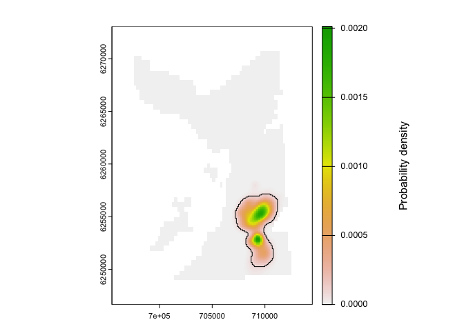

# `Patter.jl` <a href="https://edwardlavender.github.io/Patter.jl"></a>

**Particle algorithms for animal movement modelling in
[`Julia`](https://julialang.org)**

[](https://www.repostatus.org/#active)
[](https://github.com/edwardlavender/Patter.jl/actions/workflows/Documenter.yml)
[](https://github.com/edwardlavender/Patter.jl/actions/workflows/Runtests.yml)
[](https://codecov.io/gh/edwardlavender/Patter.jl)

`Patter.jl` provides particle filtering, smoothing and sampling
algorithms for animal movement modelling, with a focus on passive
acoustic telemetry systems. The package is heavily based on the
[`ParticleFish`](https://github.com/scheidan/ParticleFish.jl) package
developed by [Andreas
Scheidegger](https://www.eawag.ch/de/ueber-uns/portraet/organisation/mitarbeitende/profile/andreas-scheidegger/show/).
`Patter.jl` forms the backend for the
[`patter`](https://github.com/edwardlavender/patter)
[`R`](https://www.r-project.org) package.

> **Note:** `Patter.jl` is a new `Julia` package. Like all new packages,
> you should use it with a degree of caution. Please share feedback and
> issues.

# Highlights

`Patter.jl` is designed to reconstruct movement paths and emergent
patterns of space use from animal tracking data. A powerful, flexible,
process-orientated, particle-based framework is used for this purpose.
The essential functions are `particle_filter()` and
`particle_smoother_two_filter()`:

- **`particle_filter()`** is the particle filter. This simulates the
  possible locations of an individual moving forwards in time,
  accounting for all of the data (for example, acoustic observations,
  depth observations and any other observations) *up to* each time point
  and the animal’s movement (a partial marginal distribution).
- **`particle_smoother_two_filter()`** is a particle smoothing
  algorithm. At each time step, the smoother accounts for all of the
  data from both the past *and* the future (the full marginal
  distribution) and substantially refines maps of space use.

We hope to add backward sampling algorithms to the package in due
course.

# Installation

- Install [`Julia`](https://julialang.org) ≥ v.1.9;

- Install [`Patter.jl`](https://github.com/edwardlavender/Patter.jl):

  - Use `]` in the Julia REPL to open the package manager;
  - Use `add https://github.com/edwardlavender/Patter.jl` to install
    [`Patter.jl`](https://github.com/edwardlavender/Patter.jl);

You can also [`Patter.jl`](https://github.com/edwardlavender/Patter.jl)
via the [`patter`](https://github.com/edwardlavender/patter)
[`R`](https://www.r-project.org) wrapper.

# Functionality

## Abstract types

`Patter.jl` is based on three Abstract Types, defined in `Julia`:

- `State` structures hold the state (location) of an animal at a given
  time step;
- `ModelMove` structures hold movement model, used to simulate new
  states;
- `ModelObs` structures hold observation model parameters, used to
  evaluate the correspondence between simulated states and observations;

## Simulation

To simulate datasets, use:

- `sim_path_walk()` to simulate a movement path from a walk model (via
  `ModelMove`);
- `sim_observations()` to simulate observational time series (via
  `ModelObs`);

## Real-world datasets

To collate real-world datasets, use:

- `assemble_yobs()` to assemble a hash-table of observations and
  observation model parameters;

This function expects a `Vector` of `DataFrame`s, one for each data
type, that comprise a timeline of observations and associated model
parameters, and a corresponding `Vector` of observation model
(`ModelObs`) sub-types.

## Modelling

To simulate initial states (i.e., locations) for the particle filter,
use:

- `simulate_states_init()` to simulate states across an area;

To define a movement model, see:

- `?ModelMove` to create a movement model instance;

For available observation models, see:

- `?ModelObs`

To implement the particle filter, use:

- `particle_filter()` to run the filter;

To implement the two-filter smoother, use:

- `particle_smoother_two_filter()` to run the smoother;

# Usage

<!---
In this (hidden) section, we prepare example datasets for analysis, using functions in the wrapper `R` package. Below, these datasets are analysed in `Julia`.
-->

## Set up

This is the basic `Patter.jl` workflow to reconstruct movement paths and
patterns of space use from animal tracking data. First, we load some
essential packages:

``` julia
# Activate project
using Pkg
Pkg.activate(".")
using Patter

# Load supporting packages
import ArchGDAL
import CSV
using DataFrames
using Dates
using Distributions
import GeoArrays
using Plots
import Random
using Rasters
using RCall
```

Next, we set the seed to ensure reproducibility of our simulations and
check the number of threads:

``` julia
# Set seed
Random.seed!(123);

# Check threads
Threads.nthreads()
#> 11
```

Third, we define the properties of our study area; namely, a `Raster`
and `GeoArray` of our study area that defines the environment within
which movements are possible and the timeline over which we will model
movements:

``` julia
# Read a UTM bathymetry rasters that defines the 'environment' within which movements occurred
# * `env_init` is a Raster that is used for sampling initial states (locations)
# * `env` is a GeoArray that is used by the algorithms (faster)
env_init = Patter.rast(joinpath("data", "bathymetry.tif"));
env      = GeoArrays.read(joinpath("data", "bathymetry.tif"));

# Define a timeline for the analysis
# * This specifies the time period and resolution of the analysis
timeline = collect(DateTime("2016-03-17T01:50:00"):Minute(2):DateTime("2016-03-18T01:48:00"));
```

## Movement

We will reconstruct the movements of a tagged flapper skate (*Dipturus
intermedius*) within a study area off the west coast of Scotland, based
on electronic tagging and tracking data. To do so, we need a model for
the individual’s movements and a series of observation models that
connect movements to observations. In this example, we are interested in
the two-dimensional (x, y) location of our animal through time (that is,
the animal’s ‘state’ is an object of type `StateXY`). The animal can
move up to 750 m in two minutes, which is the resolution at which we
will model movement, and we formulate a random walk model (using a
`ModelMove` structure) accordingly based on step lengths and headings:

``` julia
# Formulate a movement model
model_move = ModelMoveXY(env, 
                         750.0,
                         truncated(Gamma(1, 250.0), upper = 750.0), 
                         Uniform(-pi, pi));
```

``` julia
# Simulate realisation(s) of the movement model
path = simulate_path_walk(xinit = [StateXY(67.87914, 708817.4, 6259203)], 
                          model_move = model_move, 
                          timeline = timeline)
#> 1×720 Matrix{StateXY}:
#>  StateXY(67.8791, 7.08817e5, 6.2592e6)  …  StateXY(21.1177, 7.04308e5, 6.26325e6)

# Extract x and y coordinates for visualisation
x = [path[1, i].x for i in 1:size(path, 2)];
y = [path[1, i].y for i in 1:size(path, 2)];

# Visualise the simulated movement path
p = plot(env, xticks = 5, yticks = 5);
scatter!(p, x, y, color = :red, label = false);
display(p)
```


See `?State` and `?ModelMove` for built-in `State`s and movement models.
Define a custom sub-type via `struct StateCustom <: Patter.State` or
`struct ModelMoveCustom <: Patter.ModelMove` and see the help files for
the additional methods that need to be provided.

## Observations

We have collected acoustic and archival (depth) observations from tagged
flapper skate. Here, we load the time series for a selected individual.
For analysis using `Patter.jl`, each dataset must comprise: a
`timestamp` column, that defines the time of an observation; a
`sensor_id` that distinguishes sensors (such as acoustic receivers), an
`obs` column that defines the observation (`0` or `1` in the case of
acoustic observations); and additional columns that define the
parameters of an observation model (`ModelObs`) structure that links
movement to the observations. The time series include (a) a standard
acoustic dataset, a corresponding dataset of acoustic containers and a
standard archival dataset. The acoustic containers dataset is derived
from the acoustic dataset and defines the maximum possible distance of
the individual from the receiver(s) that recorded the next detection(s)
at each time step. This dataset facilitates convergence in the particle
filter. The wrapper `patter` package contains helper routines for the
assembly of these datasets, if required.

``` julia
# Read acoustic (0, 1) observations
acoustics = CSV.read(joinpath("data", "acoustics.csv"), DataFrame);
first(acoustics, 6)
#> 6×8 DataFrame
#>  Row │ timestamp            sensor_id  obs    receiver_x  receiver_y  receiver ⋯
#>      │ String31             Int64      Int64  Float64     Float64     Int64    ⋯
#> ─────┼──────────────────────────────────────────────────────────────────────────
#>    1 │ 2016-03-17 01:50:00          3      0   7.06442e5   6.25401e6           ⋯
#>    2 │ 2016-03-17 01:50:00          4      0   7.09742e5   6.26771e6
#>    3 │ 2016-03-17 01:50:00          7      0   7.08742e5   6.26911e6
#>    4 │ 2016-03-17 01:50:00          9      0   7.06042e5   6.25431e6
#>    5 │ 2016-03-17 01:50:00         11      0   7.07542e5   6.26771e6           ⋯
#>    6 │ 2016-03-17 01:50:00         12      0   7.10042e5   6.26731e6
#>                                                                3 columns omitted

# Read acoustic containers looking 'forwards' or 'backwards' in time
containers_fwd = CSV.read(joinpath("data", "containers-fwd.csv"), DataFrame);
first(containers_fwd, 6)
#> 6×6 DataFrame
#>  Row │ timestamp            obs    sensor_id  receiver_x  receiver_y  radius
#>      │ String31             Int64  Int64      Float64     Float64     Int64
#> ─────┼───────────────────────────────────────────────────────────────────────
#>    1 │ 2016-03-17 01:50:00      1         26   7.09242e5   6.25311e6    1500
#>    2 │ 2016-03-17 01:52:00      1         26   7.09242e5   6.25311e6    1500
#>    3 │ 2016-03-17 01:54:00      1         26   7.09242e5   6.25311e6    2250
#>    4 │ 2016-03-17 01:56:00      1         26   7.09242e5   6.25311e6    1500
#>    5 │ 2016-03-17 01:58:00      1         26   7.09242e5   6.25311e6    1500
#>    6 │ 2016-03-17 02:00:00      1         26   7.09242e5   6.25311e6    2250
containers_bwd = CSV.read(joinpath("data", "containers-bwd.csv"), DataFrame);
first(containers_bwd, 6)
#> 6×6 DataFrame
#>  Row │ timestamp            obs    sensor_id  receiver_x  receiver_y  radius
#>      │ String31             Int64  Int64      Float64     Float64     Float64
#> ─────┼────────────────────────────────────────────────────────────────────────
#>    1 │ 2016-03-17 01:52:00      1         26   7.09242e5   6.25311e6   1500.0
#>    2 │ 2016-03-17 01:54:00      1         26   7.09242e5   6.25311e6   1500.0
#>    3 │ 2016-03-17 01:56:00      1         26   7.09242e5   6.25311e6   1500.0
#>    4 │ 2016-03-17 01:58:00      1         26   7.09242e5   6.25311e6   2250.0
#>    5 │ 2016-03-17 02:00:00      1         26   7.09242e5   6.25311e6   1500.0
#>    6 │ 2016-03-17 02:02:00      1         26   7.09242e5   6.25311e6   1500.0

# Read archival (depth) observations
archival = CSV.read(joinpath("data", "archival.csv"), DataFrame);
first(archival, 6)
#> 6×5 DataFrame
#>  Row │ timestamp            sensor_id  obs      depth_sigma  depth_deep_eps
#>      │ String31             Int64      Float64  Int64        Int64
#> ─────┼──────────────────────────────────────────────────────────────────────
#>    1 │ 2016-03-17 01:50:00          1    73.78           50              50
#>    2 │ 2016-03-17 01:52:00          1    73.32           50              50
#>    3 │ 2016-03-17 01:54:00          1    73.32           50              50
#>    4 │ 2016-03-17 01:56:00          1    73.32           50              50
#>    5 │ 2016-03-17 01:58:00          1    73.55           50              50
#>    6 │ 2016-03-17 02:00:00          1    68.7            50              50
```

Individual movements are connected to the observations by models of the
observation process for each dataset. Without going into details, here
we bundle together the observations with the parameters of the
observation models in a typed dictionary for analysis:

``` julia
# Process time stamps
acoustics.timestamp      = DateTime.(acoustics.timestamp, "yyyy-mm-dd HH:MM:SS");
containers_fwd.timestamp = DateTime.(containers_fwd.timestamp, "yyyy-mm-dd HH:MM:SS");
containers_bwd.timestamp = DateTime.(containers_bwd.timestamp, "yyyy-mm-dd HH:MM:SS");
archival.timestamp       = DateTime.(archival.timestamp, "yyyy-mm-dd HH:MM:SS");

# Collate datasets & associated `ModelObs` instances into a typed dictionary 
# * Acoustic containers are direction specific, so two datasets are required
# * (for forward & backward runs of the particle filter, respectively)
datasets_fwd        = [acoustics, containers_fwd, archival];
datasets_bwd        = [acoustics, containers_bwd, archival];
model_obs_types     = [ModelObsAcousticLogisTrunc, 
                       ModelObsAcousticContainer, 
                       ModelObsDepthNormalTruncSeabed];
yobs_fwd            = assemble_yobs(datasets = datasets_fwd,
                                    model_obs_types = model_obs_types);
yobs_bwd            = assemble_yobs(datasets = datasets_bwd,
                                    model_obs_types = model_obs_types);
```

Of course, you do not need acoustic and archival data to implement the
algorithms: these are just the data we have collected from flapper skate
and they are convenient to illustrate because we have built-in
corresponding `ModelObs` sub-types into the package. However, other
datasets can be incorporated almost as easily via custom `ModelObs`
sub-types (that is, `struct ModelObsCustom <: Patter.ModelObs`) and some
supporting methods (see the package help files for details). To simulate
observations instead, see `simulate_yobs()`.

## Particle filter

We are now in a position to run the particle filter. This runs a
simulation forwards (or backwards) in time, sampling states (locations,
termed ‘particles’) that are consistent with the movement model and the
observations up to and including each time point. We end up with a time
series (`Matrix`) of particles (`State` instances) that approximate the
partial marginal distribution for the location of the animal at each
time step:

``` julia
# Simulate initial states for the forward filter
xinit = simulate_states_init(map             = env_init, 
                             timeline        = timeline, 
                             state_type      = StateXY,
                             xinit           = nothing, 
                             model_move      = model_move, 
                             datasets        = datasets_fwd,
                             model_obs_types = model_obs_types,
                             n_particle      = 2000, 
                             direction       = "forward", 
                             output          = "Vector");

# Run the forward filter
fwd = particle_filter(timeline   = timeline,
                      xinit      = xinit,
                      yobs       = yobs_fwd,
                      model_move = model_move,
                      n_record   = 1000,
                      direction  = "forward");

# Simulate initial states for the backward filter
xinit = simulate_states_init(map             = env_init, 
                             timeline        = timeline, 
                             state_type      = StateXY,
                             xinit           = nothing, 
                             model_move      = model_move, 
                             datasets        = datasets_bwd,
                             model_obs_types = model_obs_types,
                             n_particle      = 2000, 
                             direction       = "backward", 
                             output          = "Vector");

# Run the backward filter
bwd = particle_filter(timeline   = timeline,
                      xinit      = xinit,
                      yobs       = yobs_bwd,
                      model_move = model_move,
                      n_record   = 1000,
                      direction  = "backward");
```

The filter returns a `NamedTuple` that defines the time steps of the
simulation, the simulated `State`s and other algorithm diagnostics.

``` julia
# Forward run outputs
fwd.states
#> 1000×720 Matrix{StateXY}:
#>  StateXY(45.8829, 7.09342e5, 6.25291e6)  …  StateXY(188.847, 708556.0, 6.25564e6)
#>  StateXY(66.5209, 7.09142e5, 6.25311e6)     StateXY(197.758, 7.08354e5, 6.25569e6)
#>  StateXY(41.503, 7.09542e5, 6.25291e6)      StateXY(148.489, 7.08357e5, 6.25413e6)
#>  StateXY(83.2153, 7.09042e5, 6.25321e6)     StateXY(185.685, 7.07762e5, 6.25459e6)
#>  StateXY(36.0976, 7.09742e5, 6.25271e6)     StateXY(156.188, 707140.0, 6.25435e6)
#>  StateXY(139.183, 7.08642e5, 6.25351e6)  …  StateXY(154.859, 7.08873e5, 6.25503e6)
#>  StateXY(46.8558, 7.08942e5, 6.25251e6)     StateXY(194.684, 7.07544e5, 6.25516e6)
#>  StateXY(46.5354, 7.09242e5, 6.25281e6)     StateXY(193.147, 7.08309e5, 6.25625e6)
#>  StateXY(58.245, 7.09042e5, 6.25291e6)      StateXY(191.794, 7.07576e5, 6.25459e6)
#>  StateXY(84.4729, 7.09242e5, 6.25351e6)     StateXY(143.758, 7.0913e5, 6.25544e6)
#>  ⋮                                       ⋱  
#>  StateXY(60.0933, 7.09342e5, 6.25331e6)     StateXY(157.43, 708992.0, 6.25539e6)
#>  StateXY(68.5332, 7.09242e5, 6.25331e6)     StateXY(179.343, 7.07264e5, 6.25473e6)
#>  StateXY(55.2068, 7.09642e5, 6.25361e6)     StateXY(199.453, 707926.0, 6.25602e6)
#>  StateXY(56.538, 7.09342e5, 6.25321e6)      StateXY(186.857, 7.08449e5, 6.25551e6)
#>  StateXY(45.8603, 7.09442e5, 6.25301e6)  …  StateXY(162.852, 7.08859e5, 6.25523e6)
#>  StateXY(53.0317, 7.09142e5, 6.25291e6)     StateXY(168.835, 7.08599e5, 6.25697e6)
#>  StateXY(51.6534, 7.09442e5, 6.25331e6)     StateXY(192.736, 7.0906e5, 6.25679e6)
#>  StateXY(45.8829, 7.09342e5, 6.25291e6)     StateXY(151.282, 7.08221e5, 6.25496e6)
#>  StateXY(59.7652, 7.09142e5, 6.25301e6)     StateXY(135.019, 7.0876e5, 6.25355e6)
fwd.diagnostics
#> 720×4 DataFrame
#>  Row │ timestep  timestamp            ess       maxlp
#>      │ Int64     DateTime             Float64   Float64
#> ─────┼────────────────────────────────────────────────────
#>    1 │        1  2016-03-17T01:50:00   871.187   -4.93421
#>    2 │        2  2016-03-17T01:52:00  1271.23    -4.91272
#>    3 │        3  2016-03-17T01:54:00   778.974   -9.82767
#>    4 │        4  2016-03-17T01:56:00   951.343   -4.55033
#>    5 │        5  2016-03-17T01:58:00   968.929   -4.91832
#>    6 │        6  2016-03-17T02:00:00  1318.74    -4.90221
#>    7 │        7  2016-03-17T02:02:00   823.489   -9.58653
#>    8 │        8  2016-03-17T02:04:00   933.039   -4.92097
#>   ⋮  │    ⋮               ⋮              ⋮          ⋮
#>  714 │      714  2016-03-18T01:36:00  1358.2    -37.2712
#>  715 │      715  2016-03-18T01:38:00  1242.68   -41.9696
#>  716 │      716  2016-03-18T01:40:00  1115.1    -46.6278
#>  717 │      717  2016-03-18T01:42:00  1008.86   -51.2927
#>  718 │      718  2016-03-18T01:44:00   930.228  -55.9539
#>  719 │      719  2016-03-18T01:46:00  1898.44    -4.658
#>  720 │      720  2016-03-18T01:48:00  1783.25    -9.31601
#>                                           705 rows omitted
fwd.callstats
#> 1×6 DataFrame
#>  Row │ timestamp                routine          n_particle  n_iter  convergen ⋯
#>      │ DateTime                 String           Int64       Int64   Bool      ⋯
#> ─────┼──────────────────────────────────────────────────────────────────────────
#>    1 │ 2025-02-12T22:37:48.450  filter: forward        2000       1         tr ⋯
#>                                                                2 columns omitted
fwd.callstats.convergence
#> 1-element Vector{Bool}:
#>  1
fwd.callstats.time
#> 1-element Vector{Float64}:
#>  0.648

# Backward run outputs
bwd.states
#> 1000×720 Matrix{StateXY}:
#>  StateXY(1.85675e-314, 2.51161e-314, 2.75044e-314)  …  StateXY(176.919, 7.07942e5, 6.26601e6)
#>  StateXY(2.17775e-314, 1.97536e-317, 0.0)              StateXY(178.939, 7.09242e5, 6.26781e6)
#>  StateXY(-1.2162e6, -1.21608e6, -1.21596e6)            StateXY(180.867, 7.09042e5, 6.26631e6)
#>  StateXY(-1.21584e6, -1.21572e6, -1.2156e6)            StateXY(132.345, 7.11142e5, 6.27061e6)
#>  StateXY(-1.21548e6, -1.21536e6, -1.21524e6)           StateXY(149.448, 7.09242e5, 6.25831e6)
#>  StateXY(-1.21512e6, -1.215e6, -1.21488e6)          …  StateXY(155.992, 7.09842e5, 6.26861e6)
#>  StateXY(-1.21476e6, -1.21464e6, -1.21452e6)           StateXY(191.569, 7.07442e5, 6.26681e6)
#>  StateXY(-1.2144e6, -1.21428e6, -1.21416e6)            StateXY(178.48, 7.07342e5, 6.26711e6)
#>  StateXY(-1.21404e6, -1.21392e6, -1.2138e6)            StateXY(183.963, 7.07542e5, 6.26721e6)
#>  StateXY(-1.21368e6, -1.21356e6, -1.21344e6)           StateXY(144.53, 7.06742e5, 6.25011e6)
#>  ⋮                                                  ⋱  
#>  StateXY(-860160.0, -860040.0, -859920.0)              StateXY(162.061, 7.07942e5, 6.26531e6)
#>  StateXY(-859800.0, -859680.0, -859560.0)              StateXY(190.686, 7.08342e5, 6.26681e6)
#>  StateXY(-859440.0, -859320.0, -859200.0)              StateXY(186.824, 7.08642e5, 6.25571e6)
#>  StateXY(-859080.0, -858960.0, -858840.0)              StateXY(167.287, 7.08242e5, 6.26821e6)
#>  StateXY(-858720.0, -858600.0, -858480.0)           …  StateXY(188.622, 7.08842e5, 6.25691e6)
#>  StateXY(-858360.0, -858240.0, -858120.0)              StateXY(191.973, 7.06142e5, 6.24931e6)
#>  StateXY(-858000.0, -857880.0, -857760.0)              StateXY(181.723, 7.08342e5, 6.25641e6)
#>  StateXY(-857640.0, -857520.0, -857400.0)              StateXY(186.239, 7.08642e5, 6.26641e6)
#>  StateXY(-857280.0, -857160.0, -857040.0)              StateXY(148.615, 7.04442e5, 6.24911e6)
bwd.diagnostics
#> 720×4 DataFrame
#>  Row │ timestep  timestamp            ess       maxlp
#>      │ Int64     DateTime             Float64   Float64
#> ─────┼────────────────────────────────────────────────────
#>    1 │        1  2016-03-17T01:50:00   NaN      NaN
#>    2 │        2  2016-03-17T01:52:00   NaN      NaN
#>    3 │        3  2016-03-17T01:54:00   NaN      NaN
#>    4 │        4  2016-03-17T01:56:00   NaN      NaN
#>    5 │        5  2016-03-17T01:58:00   NaN      NaN
#>    6 │        6  2016-03-17T02:00:00   NaN      NaN
#>    7 │        7  2016-03-17T02:02:00   NaN      NaN
#>    8 │        8  2016-03-17T02:04:00   NaN      NaN
#>   ⋮  │    ⋮               ⋮              ⋮          ⋮
#>  714 │      714  2016-03-18T01:36:00  1025.64   -32.6163
#>  715 │      715  2016-03-18T01:38:00  1062.47   -27.9509
#>  716 │      716  2016-03-18T01:40:00  1144.41   -23.2914
#>  717 │      717  2016-03-18T01:42:00  1259.77   -18.6324
#>  718 │      718  2016-03-18T01:44:00  1435.05   -13.974
#>  719 │      719  2016-03-18T01:46:00  1625.19    -9.31601
#>  720 │      720  2016-03-18T01:48:00  1884.65    -4.658
#>                                           705 rows omitted
bwd.callstats
#> 1×6 DataFrame
#>  Row │ timestamp                routine           n_particle  n_iter  converge ⋯
#>      │ DateTime                 String            Int64       Int64   Bool     ⋯
#> ─────┼──────────────────────────────────────────────────────────────────────────
#>    1 │ 2025-02-12T22:37:49.249  filter: backward        2000       1        fa ⋯
#>                                                                2 columns omitted
bwd.callstats.convergence
#> 1-element Vector{Bool}:
#>  0
bwd.callstats.time
#> 1-element Vector{Float64}:
#>  0.352
```

## Particle smoother

Particle smoothers refine the outputs from the particle filter. Smoothed
particles approximate the full marginal distribution for the location of
the individual at each time step (accounting for all of the data before
and after each step):

``` julia
# (optional) Set vmap to improve speed here
n_particle = 750;
smo = particle_smoother_two_filter(timeline   = timeline,
                                   xfwd       = fwd.states[1:n_particle, :],
                                   xbwd       = bwd.states[1:n_particle, :],
                                   model_move = model_move,
                                   vmap       = nothing,
                                   n_sim      = 100, 
                                   cache      = true);

# Smooth outputs
smo.states
#> 750×720 Matrix{StateXY}:
#>  StateXY(1.85675e-314, 2.51161e-314, 2.75044e-314)  …  StateXY(188.847, 708556.0, 6.25564e6)
#>  StateXY(2.17775e-314, 1.97536e-317, 0.0)              StateXY(197.758, 7.08354e5, 6.25569e6)
#>  StateXY(-1.2162e6, -1.21608e6, -1.21596e6)            StateXY(148.489, 7.08357e5, 6.25413e6)
#>  StateXY(-1.21584e6, -1.21572e6, -1.2156e6)            StateXY(185.685, 7.07762e5, 6.25459e6)
#>  StateXY(-1.21548e6, -1.21536e6, -1.21524e6)           StateXY(156.188, 707140.0, 6.25435e6)
#>  StateXY(-1.21512e6, -1.215e6, -1.21488e6)          …  StateXY(154.859, 7.08873e5, 6.25503e6)
#>  StateXY(-1.21476e6, -1.21464e6, -1.21452e6)           StateXY(194.684, 7.07544e5, 6.25516e6)
#>  StateXY(-1.2144e6, -1.21428e6, -1.21416e6)            StateXY(193.147, 7.08309e5, 6.25625e6)
#>  StateXY(-1.21404e6, -1.21392e6, -1.2138e6)            StateXY(191.794, 7.07576e5, 6.25459e6)
#>  StateXY(-1.21368e6, -1.21356e6, -1.21344e6)           StateXY(143.758, 7.0913e5, 6.25544e6)
#>  ⋮                                                  ⋱  
#>  StateXY(-950160.0, -950040.0, -949920.0)              StateXY(156.14, 7.07771e5, 6.2541e6)
#>  StateXY(-949800.0, -949680.0, -949560.0)              StateXY(188.297, 7.07872e5, 6.25514e6)
#>  StateXY(-949440.0, -949320.0, -949200.0)              StateXY(147.888, 7.07284e5, 6.25544e6)
#>  StateXY(-949080.0, -948960.0, -948840.0)              StateXY(145.139, 7.08266e5, 6.2545e6)
#>  StateXY(-948720.0, -948600.0, -948480.0)           …  StateXY(175.94, 7.07905e5, 6.25489e6)
#>  StateXY(-948360.0, -948240.0, -948120.0)              StateXY(197.11, 7.07837e5, 6.25553e6)
#>  StateXY(-948000.0, -947880.0, -947760.0)              StateXY(184.627, 7.08884e5, 6.25712e6)
#>  StateXY(-947640.0, -947520.0, -947400.0)              StateXY(188.208, 7.0792e5, 6.25527e6)
#>  StateXY(-947280.0, -947160.0, -947040.0)              StateXY(137.22, 7.08909e5, 6.25457e6)
smo.diagnostics
#> 720×4 DataFrame
#>  Row │ timestep  timestamp            ess      maxlp
#>      │ Int64     DateTime             Float64  Float64
#> ─────┼─────────────────────────────────────────────────
#>    1 │        1  2016-03-17T01:50:00  750.0        NaN
#>    2 │        2  2016-03-17T01:52:00  NaN          NaN
#>    3 │        3  2016-03-17T01:54:00  NaN          NaN
#>    4 │        4  2016-03-17T01:56:00  NaN          NaN
#>    5 │        5  2016-03-17T01:58:00  NaN          NaN
#>    6 │        6  2016-03-17T02:00:00  NaN          NaN
#>    7 │        7  2016-03-17T02:02:00  NaN          NaN
#>    8 │        8  2016-03-17T02:04:00  NaN          NaN
#>   ⋮  │    ⋮               ⋮              ⋮        ⋮
#>  714 │      714  2016-03-18T01:36:00  118.385      NaN
#>  715 │      715  2016-03-18T01:38:00  127.608      NaN
#>  716 │      716  2016-03-18T01:40:00  143.037      NaN
#>  717 │      717  2016-03-18T01:42:00  136.04       NaN
#>  718 │      718  2016-03-18T01:44:00  148.45       NaN
#>  719 │      719  2016-03-18T01:46:00  150.694      NaN
#>  720 │      720  2016-03-18T01:48:00  750.0        NaN
#>                                        705 rows omitted
smo.callstats
#> 1×6 DataFrame
#>  Row │ timestamp                routine               n_particle  n_iter   con ⋯
#>      │ DateTime                 String                Int64       Float64  Boo ⋯
#> ─────┼──────────────────────────────────────────────────────────────────────────
#>    1 │ 2025-02-12T22:37:50.663  smoother: two-filter         750      NaN      ⋯
#>                                                                2 columns omitted
smo.callstats.convergence
#> 1-element Vector{Bool}:
#>  0
smo.callstats.time
#> 1-element Vector{Float64}:
#>  16.03
```

# Mapping

Particles can be used to reconstruct movement paths and patterns of
space use. At the time of writing, `Patter.jl` focuses entirely on the
provision of fast particle algorithms and lacks supporting routines for
mapping and visualisation. However, we can easily estimate a utilisation
distribution from `Julia` using the wrapper `patter` `R` package via
`RCall` (on Windows and MacOS). This is the `R` code:

``` r
# Load & attach packages
library(patter, quietly = TRUE)
library(spatstat.explore, quietly = TRUE, warn.conflicts = FALSE)
op <- options(terra.pal = rev(terrain.colors(256)))
              
# Read map 
map <- terra::rast(file.path("data", "bathymetry.tif"))

# Convert smoothed particles from `Julia` into a `pf_particles` object
smo <- patter:::pf_particles(.pf_obj = "smo")

# Estimate UD
ud <- map_dens(.map     = map,
               .coord   = smo$states,
               .sigma   = bw.h, 
               .verbose = FALSE)$ud
#> Warning: 84660 points were rejected as lying outside the specified window

# Add home range
map_hr_home(ud, .add = TRUE)
mtext(side = 4, "Probability density", line = -3)
```



``` r

options(op)
```

This basic workflow is highly customisable. You have the flexibility to
define species-specific movement models, include any type of
observational dataset and implement system-specific observation models.
See the function examples for further details and reach out with
queries.

# Resources

**For full details on the methods**, see the references below.

**For further information of the `Patter.jl` package**, see:

- The [online](https://edwardlavender.github.io/Patter.jl/) package
  documentation;
- `?patter::particle_filter()` for information on specific functions;

**For additional resources**, see the documentation for the
[`patter`](https://github.com/edwardlavender/patter) `R` package.

# Disclaimer and troubleshooting

`Patter` is a new `Julia` package. All routines are experimental.
Researchers interested in using the package are encouraged to get in
touch while the methods and package remain at an early stage of
evolution (<edward.lavender@eawag.ch>).

# Citation

To cite `patter` in publications, please use:

- Lavender, E. et al. (2023). An integrative modelling framework for
  passive acoustic telemetry. Methods in Ecology and Evolution.
  <https://doi.org/10.1111/2041-210X.14193>
- Lavender, E. et al. (in prep). Particle algorithms for animal movement
  modelling in autonomous receiver networks.
- Lavender, E. et al. (in prep). Particle algorithms for animal tracking
  in `R` and `Julia`. <https://doi.org/10.1101/2024.07.30.605733>
- Lavender, E. et al. (in prep). Particle filtering reveals patterns of
  space use in a Critically Endangered elasmobranch.

------------------------------------------------------------------------

Please note that `patter` is released with a [Contributor Code of
Conduct](https://contributor-covenant.org/version/2/1/CODE_OF_CONDUCT.html).
By contributing to this project, you agree to abide by its terms.
